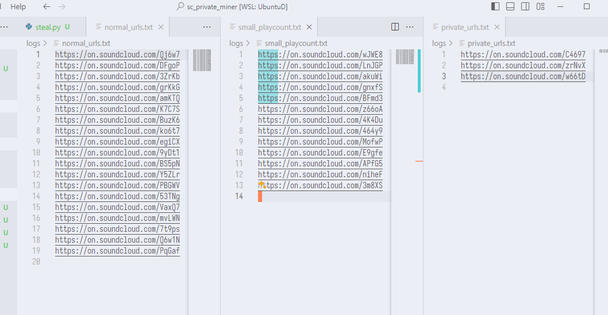

# sc_private_miner



## setup

```bash
git clone <this repo>
cd sc_private_miner
pip3 install -r requirements.txt
python3 mining.py
```

## settings

```json
{
  // concurrent number
  "CONCURRENT_TASKS": 1,
  // private url data server url
  "DATA_SERVER_URL": "https://sc-private-miner-kgt3lbt42a-an.a.run.app",
  // nya
  "PUBLIC_SMALL_PLAYCOUNT_THRESHOLD": 50000,
  "PRIVATE_BIG_ARTIST_THRESHOLD": 1000,
  "PRIVATE_SMALL_ARTIST_URLS_FILENAME": "mining_private_small_artist_urls.txt",
  "PRIVATE_BIG_ARTIST_URLS_FILENAME": "mining_private_big_artist_urls.txt",
  "PUBLIC_SMALL_PLAYCOUNT_URLS_FILENAME": "mining_public_small_playcount_urls.txt",
  "PUBLIC_BIG_PLAYCOUNT_URLS_FILENAME": "mining_public_big_playcount_urls.txt"
}
```
